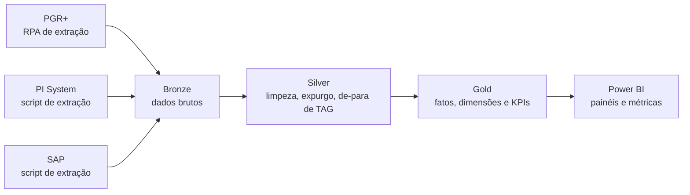

# RCA Cortadeiras L1 e L2: da análise de falhas ao BI de acompanhamento

> **Projeto concluído.**
> Desenvolvimento do BI, das métricas e do Power BI: **Ryan Lobato**, em Inteligência de Negócios, alinhada com Confiabilidade e Processos.
> Análise de falhas original (RCA): Moacyr Angeli Junior e equipe multidisciplinar, Projeto Cerrado, Suzano.

---

## Sumário

1. [Visão geral](#visão-geral)
2. [Arquivos do projeto](#arquivos-do-projeto)
3. [Contexto: a análise de falhas (RCA)](#contexto-a-análise-de-falhas-rca)
4. [O projeto de BI](#o-projeto-de-bi)
5. [Arquitetura e fluxo de dados](#arquitetura-e-fluxo-de-dados)
6. [Modelo de dados](#modelo-de-dados)
7. [Da causa raiz ao indicador](#da-causa-raiz-ao-indicador)
8. [Painel no Power BI](#painel-no-power-bi)
9. [Ciclo de atualização](#ciclo-de-atualização)
10. [Stack](#stack)
11. [Estrutura sugerida do repositório](#estrutura-sugerida-do-repositório)
12. [Qualidade e reconciliação](#qualidade-e-reconciliação)
13. [Governança e aviso de uso](#governança-e-aviso-de-uso)
14. [Autoria e créditos](#autoria-e-créditos)

---

## Visão geral

As cortadeiras de celulose L1 e L2 (TAGs `2298-3150` e `2298-3250`) acumularam cerca de **320 horas de rejeição** entre janeiro e agosto de 2025. A análise de falhas (RCA, Faixa 2) estratificou as causas, montou árvores de falha (FTA) e definiu um plano de **16 ações**.

Faltava uma forma periódica e confiável de **acompanhar** se cada ação bloqueou a causa. Este projeto responde a essa lacuna com um BI que integra três fontes (PGR+, PI System e SAP), organiza os dados em camadas e publica as métricas em um painel no Power BI, atualizado **a cada 8 horas**.

| Indicador (base PGR+, Jan–Ago/2025) | Valor |
|---|---|
| Rejeição acumulada, Cortadeira L1 | 164,93 h |
| Rejeição acumulada, Cortadeira L2 | 156,47 h |
| Parada estimada no ano | ~320 h |
| Ações no plano de ação | 16 (5 específicas da L2 e 11 comuns a L1 e L2) |
| Ciclo de atualização do BI | 8 horas (carga em lote) |

---

## Contexto: a análise de falhas (RCA)

- **Escopo:** rejeições nas cortadeiras e no enfardamento, com base nas ocorrências do PGR+. Foram expurgadas as ocorrências externas à cortadeira e ao enfardamento (exceto variações de perfil da folha) e o corte de capas.
- **Período:** janeiro a agosto de 2025.
- **Equipe:** Mecânica, Elétrica, Instrumentação e Operação.
- **Ferramenta analítica:** árvore de falhas (FTA), a partir do Pareto por equipamento/sistema.

### Principais ofensores (Pareto, horas)

| Equipamento / sistema | L1 | L2 |
|---|---|---|
| Caixa de fardos | 58,49 | 34,76 |
| Facas transversais | 7,50 | 27,41 |
| Mesa de garfos | 15,58 | 14,95 |
| Facas longitudinais | 14,53 | 14,52 |
| Folha (variação de perfil) | 11,38 | 9,57 |
| Sensores | 9,36 | 7,39 |
| Cortadeira (L2) | 4,97 | 21,50 |

### Causas e ações

- **Embolamentos em caixas de formação:** ajuste e fixação das divisórias, perfis-guia (bicos de pato) desgastados, roldanas, polias e fitas longas.
- **Falhas de corte:** sistema hidráulico da contra-faca, desgaste de facas, temperatura do rolo faca em dias frios e variação de pressão de vapor.
- **Sensores:** atuação indevida por sujidade, folhas ou divisórias.
- **Mesa de garfos:** desnivelamento, perda de sincronismo e travamento de rolamentos.

---

## O projeto de BI

**Objetivo:** acompanhar, de forma periódica e confiável, o tempo de rejeição das cortadeiras e a eficácia de cada ação do plano, integrando o evento (PGR+), o processo (PI System) e a manutenção (SAP).

| Fonte | Responde | Papel no modelo |
|---|---|---|
| **PGR+** | O que foi registrado como ocorrência, por quanto tempo e com qual causa | Evento (rótulo) |
| **PI System** | O que o processo estava fazendo antes, durante e depois | Sinais (evidência) |
| **SAP** | O que a manutenção fez: notas, ordens, peças e custo | Intervenção (ação e custo) |

**Perguntas que o BI responde**

- Quanto tempo de rejeição cada cortadeira acumula, comparado ao baseline Jan–Ago/25?
- Qual o Pareto atual por equipamento/sistema?
- Cada ação do plano reduziu as horas da causa que deveria bloquear (antes e depois)?
- Que comportamento dos sinais antecede cada tipo de falha?
- Como se relacionam intervenções corretivas e preventivas com paradas e emergências?
- A causa apontada no PGR+ coincide com o que o PI e o SAP mostram?

---

## Arquitetura e fluxo de dados



| Camada | Conteúdo |
|---|---|
| **Extração** | RPA no PGR+; scripts de extração no PI System e no SAP |
| **Bronze** | Dados exatamente como saíram da origem, guardados por data de extração |
| **Silver** | Tipos, datas e durações padronizados, remoção de duplicatas entre extrações, regra de expurgo da RCA e de-para de TAGs |
| **Gold** | Fatos e dimensões, agregados do Pareto e KPIs |
| **Consumo** | Painéis e métricas no Power BI |

**Chave de integração:** a TAG do equipamento (ponte entre SAP, PI e PGR+) e a janela de tempo (liga cada rejeição aos sinais do processo). Fuso e granularidade devem ser normalizados na Silver, preservando o valor original.

---

## Modelo de dados

**Fatos**

| Tabela | Conteúdo |
|---|---|
| `fato_parada` | Rejeições, paradas e emergências: origem, duração, equipamento, causa, classificação |
| `fato_sinal_processo` | Séries do PI por TAG, agregadas por janela (média, mínimo, máximo, desvio) |
| `fato_manutencao` | Notas e ordens do SAP: tipo, datas, horas, peças e custo |
| `fato_evento_janela` | Resumo dos sinais antes, durante e depois de cada parada |

**Dimensões**

| Tabela | Conteúdo |
|---|---|
| `dim_equipamento` | Cortadeira, TAG, sistema e agrupamento dos problemas priorizados |
| `dim_causa_raiz` | Liga cada categoria do Pareto aos ramos das árvores de falha |
| `dim_plano_acao` | Ação, causa bloqueada, responsável, prazo, status e data de conclusão (com vínculo à ordem do SAP, quando houver) |
| `dim_tempo` | Dia, semana, mês e turno |

A `dim_plano_acao` permite comparar o tempo de rejeição **antes e depois** da conclusão de cada ação.

---

## Da causa raiz ao indicador

| Problema priorizado | Pareto Jan–Ago/25 | Indicadores e sinais (PI / PGR+ / SAP) |
|---|---|---|
| Embolamento em caixas de fardos | L1 58,49 h \| L2 34,76 h | Eventos por caixa, sensores, divisórias; ordens de reparo de perfis-guia |
| Falhas de corte transversal | L2 27,41 h \| L1 7,50 h | Pressão hidráulica da contra-faca, temperatura da água do rolo faca |
| Variações de perfil | L1 11,38 h \| L2 9,57 h | Pressão e fluxo de vapor dos secadores, gramatura |
| Problemas em sensores | L1 9,36 h \| L2 7,39 h | Frequência e duração de atuações; rotina de limpeza |
| Mesa de garfos | L1 15,58 h \| L2 14,95 h | Tempo de translação, sincronismo; ordens de lubrificação |
| Corte longitudinal | L1 14,53 h \| L2 14,52 h | Pressão de ar das facas; trocas e ajustes no SAP |

---

## Painel no Power BI

O slide 9 do PPTX simula o painel padronizado, com fundo inspirado em papel celulose e o logotipo da Suzano:

- Filtros: período, cortadeira e meses.
- Cartões de KPI: rejeição acumulada L1 e L2, parada estimada no ano e ciclo de atualização.
- Visuais: tempo de rejeição mensal por cortadeira, Pareto empilhado por equipamento/sistema e participação de cada cortadeira no acumulado.

> O slide é uma **ilustração**. Os valores vêm do documento da RCA (Jan–Ago/25).

---

## Ciclo de atualização

O acompanhamento é **normal, em lote, a cada 8 horas** (3 ciclos por dia), e não em tempo real.

1. **Extração:** RPA no PGR+ e scripts no PI System e no SAP.
2. **Bronze:** dados brutos guardados por extração.
3. **ETL:** limpeza, expurgo e de-para de TAGs.
4. **Modelo Gold:** fatos, dimensões, KPIs e Pareto.
5. **Power BI:** atualização dos painéis.

---

## Stack

- **Extração:** RPA (PGR+) e scripts (PI System e SAP)
- **Processamento:** Python, Polars e Pandas
- **Armazenamento:** arquivos locais em camadas (Parquet/CSV)
- **Visualização:** Power BI
- **Documentação:** PDF (RCA) e PowerPoint (apresentação do BI)

---

## Estrutura sugerida do repositório

```text
rca-cortadeiras-bi/
├── README.md
├── docs/
│   ├── RCA_CORTADEIRAS_L1_E_L2_2025_21-08-25.pdf
│   └── RCA_Cortadeiras_BI_Ryan_Lobato.pptx
├── extracao/          # RPA do PGR+ e scripts de PI System e SAP
├── etl/
│   ├── silver.py      # limpeza, expurgo e de-para de TAGs
│   ├── gold.py        # fatos, dimensões e KPIs
│   └── qualidade.py   # reconciliação com a RCA
├── dados/             # bronze, silver e gold (fora do versionamento)
└── powerbi/           # modelo e relatórios
```

> Estrutura de referência. Dados corporativos não devem ser versionados.

---

## Qualidade e reconciliação

- **Reconciliação com a RCA:** a Silver, com a regra de expurgo, deve fechar Jan–Ago/25 em **164,93 h (L1)** e **156,47 h (L2)**.
- **Validações:** duplicatas, durações negativas ou nulas, equipamentos sem mapeamento de TAG, cobertura de sinais do PI (lacunas e valores travados) e contagem de ordens do SAP.
- **Rastreabilidade:** cada carga registra data da extração e filtros usados, permitindo refazer ou auditar o histórico.
- **Rótulo da causa:** divergências entre o PGR+, o PI e o SAP são tratadas como achado de análise, não como erro de dado.

---

## Governança e aviso de uso

- Este repositório é **ilustrativo**, para portfólio.
- Os valores, as TAGs e a identidade visual vêm de um documento interno da Suzano. Antes de publicar, confirme a autorização para divulgar esses dados e a marca, ou use uma versão anonimizada.
- Não versione dados extraídos do PGR+, do PI System ou do SAP, nem credenciais.

---

## Autoria e créditos

| Papel | Nome |
|---|---|
| BI, métricas e Power BI | **Ryan Lobato** (Engenharia de Dados) |
| Responsável pela análise de falhas (RCA) | Moacyr Angeli Junior |
| Análise de falhas | Equipe multidisciplinar de Mecânica, Elétrica, Instrumentação e Operação |

**Projeto Cerrado | Suzano**
